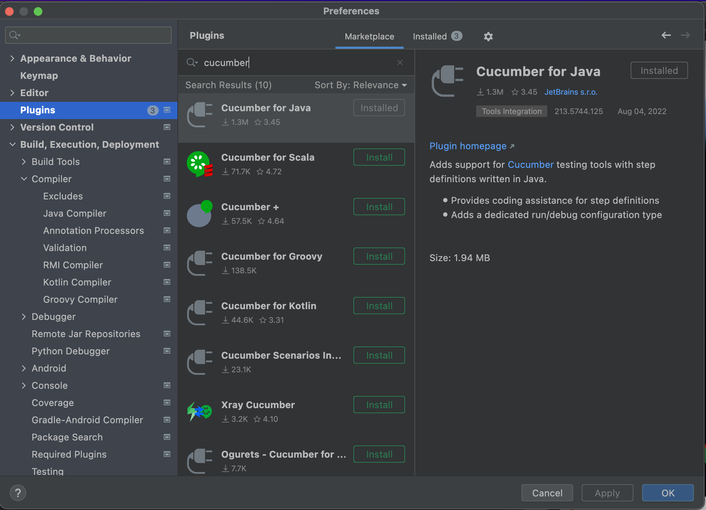
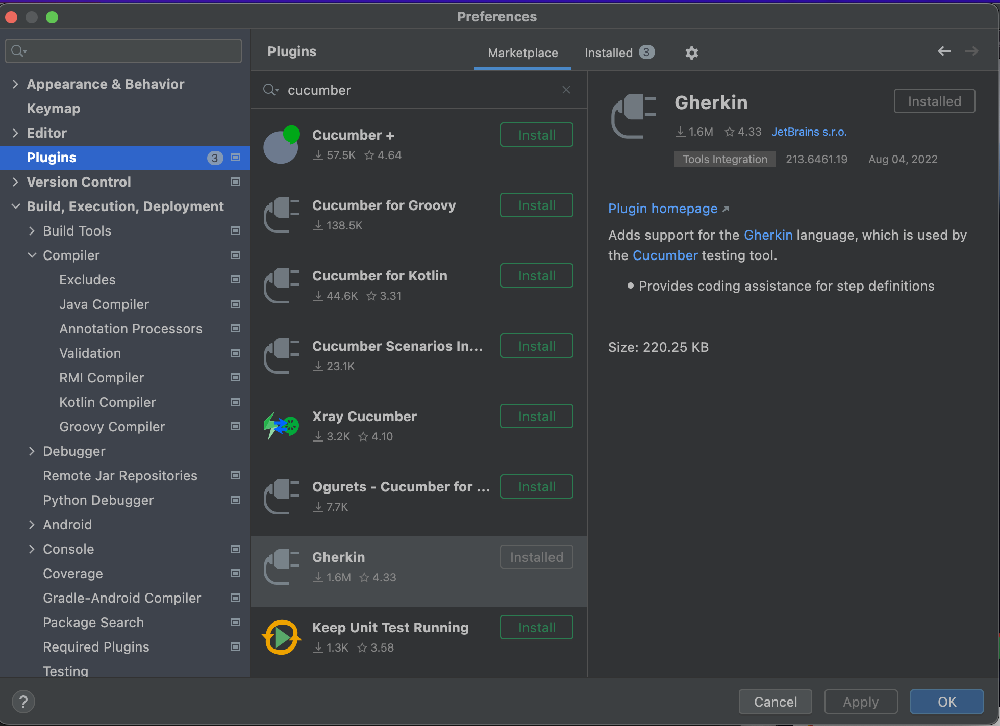

# JobstreetTestingJavaJobs
## Software Requirement Testing
- Selenium
- Cucumber
- TestNG
## Dependencies yang harus diinstall
```<?xml version="1.0" encoding="UTF-8"?>
<project xmlns="http://maven.apache.org/POM/4.0.0"
         xmlns:xsi="http://www.w3.org/2001/XMLSchema-instance"
         xsi:schemaLocation="http://maven.apache.org/POM/4.0.0 http://maven.apache.org/xsd/maven-4.0.0.xsd">
    <modelVersion>4.0.0</modelVersion>

    <groupId>org.example</groupId>
    <artifactId>TestNGCucumber</artifactId>
    <version>1.0-SNAPSHOT</version>

    <properties>
        <maven.compiler.source>8</maven.compiler.source>
        <maven.compiler.target>8</maven.compiler.target>


            <project.build.sourceEncoding>UTF-8</project.build.sourceEncoding>
            <selenium.version>3.141.59</selenium.version>
            <cucumber.version>5.7.0</cucumber.version>
            <testng.version>7.4.0</testng.version>
            <allure.cucumber5.version>2.14.0</allure.cucumber5.version>
            <maven.compiler.plugin.version>3.5.1</maven.compiler.plugin.version>
            <maven.surefire.plugin.version>3.0.0-M5</maven.surefire.plugin.version>
            <maven.compiler.source>11</maven.compiler.source>
            <maven.compiler.target>11</maven.compiler.target>
            <aspectj.version>1.9.6</aspectj.version>
            <allure.maven.version>2.10.0</allure.maven.version>

    </properties>

    <dependencies>
        <!-- https://mvnrepository.com/artifact/io.qameta.allure/allure-cucumber7-jvm -->
        <dependency>
            <groupId>io.qameta.allure</groupId>
            <artifactId>allure-cucumber7-jvm</artifactId>
            <version>2.19.0</version>
        </dependency>

        <!-- https://mvnrepository.com/artifact/io.cucumber/cucumber-junit -->
        <dependency>
            <groupId>io.cucumber</groupId>
            <artifactId>cucumber-junit</artifactId>
            <version>7.6.0</version>
            <scope>test</scope>
        </dependency>

        <dependency>
            <groupId>org.seleniumhq.selenium</groupId>
            <artifactId>selenium-java</artifactId>
            <version>4.4.0</version>
        </dependency>

        <dependency>
            <groupId>org.testng</groupId>
            <artifactId>testng</artifactId>
            <version>7.6.1</version>
            <scope>test</scope>
        </dependency>

        <dependency>
            <groupId>io.cucumber</groupId>
            <artifactId>cucumber-testng</artifactId>
            <version>7.6.0</version>
        </dependency>

        <!-- https://mvnrepository.com/artifact/io.cucumber/cucumber-java -->
        <dependency>
            <groupId>io.cucumber</groupId>
            <artifactId>cucumber-java</artifactId>
            <version>7.6.0</version>
        </dependency>

        <!-- https://mvnrepository.com/artifact/io.cucumber/cucumber-core -->
        <dependency>
            <groupId>io.cucumber</groupId>
            <artifactId>cucumber-core</artifactId>
            <version>7.6.0</version>
        </dependency>

        <dependency>
            <groupId>org.hamcrest</groupId>
            <artifactId>hamcrest</artifactId>
            <version>2.2</version>
            <scope>test</scope>
        </dependency>

        <!-- https://mvnrepository.com/artifact/io.cucumber/gherkin -->
        <dependency>
            <groupId>io.cucumber</groupId>
            <artifactId>gherkin</artifactId>
            <version>24.0.0</version>
        </dependency>

    </dependencies>

    <build>
        <plugins>
            <plugin>
                <groupId>org.apache.maven.plugins</groupId>
                <artifactId>maven-surefire-plugin</artifactId>
                <version>2.20</version>
                <configuration>
                    <suiteXmlFiles>
                        <suiteXmlFile>TestNG.xml</suiteXmlFile>
                    </suiteXmlFiles>

                    <argLine>
                        -javaagent:"${settings.localRepository}/org/aspectj/aspectjweaver/1.9.9.1/aspectjweaver-1.9.9.1.jar"
                        -Dcucumber.options="--plugin io.qameta.allure.cucumber7jvm.AllureCucumber7Jvm"
                    </argLine>

                    <!--
                  <systemPropertyVariables>
                      <allure.results.directory>/target/allure-results</allure.results.directory>
                  </systemPropertyVariables>

                 <resources>
                     <resource>
                         <directory>src/main/resources</directory>
                         <includes>
                             <include>environment.xml</include>
                         </includes>
                     </resource>
                 </resources>
                 -->

                </configuration>
                <dependencies>
                    <dependency>
                        <groupId>org.aspectj</groupId>
                        <artifactId>aspectjweaver</artifactId>
                        <version>1.9.9.1</version>
                    </dependency>
                </dependencies>
            </plugin>

            <plugin>
                <groupId>io.qameta.allure</groupId>
                <artifactId>allure-maven</artifactId>
                <version>2.10.0</version>
                <configuration>
                    <reportVersion>1.9.6</reportVersion>
                </configuration>
            </plugin>

        </plugins>
    </build>


</project>
```
## Install plugin cucumber di IntellJ
- Cucumber Plugins
  
- Ghrekin Plugins
  
## Result Testing
  
## Running allure framework with command
  ``` allure serve allure-results ``` <br/>
  in the directory of the project so it will display the reporting of the test
  